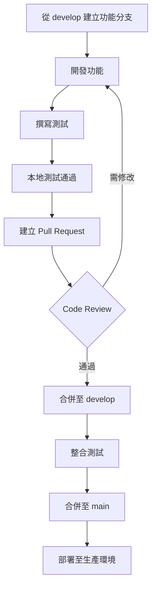

# Document LLM Analysis - 開發、部署與維護指南

> **版本**: 1.0.0  
> **最後更新**: 2026-03-25  
> **維護團隊**: Document LLM Analysis Team

---

## 目錄

- [1. 概覽](#1-概覽)
- [2. 開發環境設定](#2-開發環境設定)
- [3. 專案結構說明](#3-專案結構說明)
- [4. 開發規範](#4-開發規範)
- [5. 測試指南](#5-測試指南)
- [6. API 開發指南](#6-api-開發指南)
- [7. 部署流程](#7-部署流程)
- [8. CI/CD 流程](#8-cicd-流程)
- [9. 維護操作](#9-維護操作)
- [10. 監控與告警](#10-監控與告警)
- [11. 故障排除](#11-故障排除)
- [12. 安全性指南](#12-安全性指南)
- [附錄](#附錄)

---

## 1. 概覽

### 1.1 文件目的

本文件為 **Document LLM Analysis** 專案的完整開發、部署與維護指南，涵蓋：

- 開發環境設定與專案結構
- 程式碼規範與測試策略
- Docker 容器化部署流程
- CI/CD 自動化管線
- 日常維護操作與故障排除
- 安全性最佳實踐

### 1.2 目標讀者

| 角色 | 適用章節 |
|------|----------|
| **新加入開發者** | 1-6、11-12 |
| **維運人員** | 7-11 |
| **專案管理者** | 1、3、7、10 |

### 1.3 專案簡介

**Document LLM Analysis Agent** 是一個專為**專業文件處理**與**結構化數據分析**設計的 AI 助手。

#### 核心功能

| 功能模組 | 說明 |
|----------|------|
| **Agent Workspace** | 三階段智慧分析工作流（建議→執行→判讀） |
| **RAG Search** | 語義搜尋與文件檢索系統 |
| **Statistical Analysis** | 探索性資料分析與統計檢定 |
| **Report Generation** | 自動化報告生成 |
| **Data Query** | 自然語言轉 Pandas/SQL 查詢 |

#### 技術棧

| 層級 | 技術 |
|------|------|
| **Frontend** | Next.js 16, React 19, Tailwind CSS 4, Zustand |
| **Backend** | FastAPI, LangGraph, LangChain |
| **Database** | ChromaDB (向量), DuckDB (SQL) |
| **ML** | Sentence-Transformers (BGE-M3), scikit-learn |
| **LLM** | Google Gemini / OpenAI / 本地 LLM |

---

## 2. 開發環境設定

### 2.1 系統需求

#### 最低需求

| 項目 | 版本 |
|------|------|
| Python | 3.12+ |
| Node.js | 18+ |
| pip | 最新版 |
| Git | 2.30+ |

#### 建議硬體規格

| 項目 | 最低 | 建議 |
|------|------|------|
| CPU | 4 核心 | 8 核心+ |
| RAM | 8 GB | 16 GB+ |
| 儲存空間 | 20 GB | 50 GB+ |

### 2.2 ⚡ Quick Start（30 秒啟動）

```bash
git clone https://github.com/your-org/document-llm-analysis.git && cd document-llm-analysis
python3 -m venv .venv && source .venv/bin/activate
cp .env.example .env  # 填入 GOOGLE_API_KEY
pip install -r requirements.txt
uvicorn backend.app.main:app --reload &  # Backend :8000
cd frontend && npm install && npm run dev  # Frontend :3000
```

### 2.3 Python 環境設定

#### Step 1: 複製專案

```bash
# 複製專案
git clone https://github.com/your-org/document-llm-analysis.git
cd document-llm-analysis
```

#### Step 2: 建立虛擬環境

```bash
# 建立虛擬環境
python3 -m venv .venv

# 啟動虛擬環境
# macOS/Linux
source .venv/bin/activate

# Windows
.\.venv\Scripts\activate
```

#### Step 3: 安裝 Python 依賴

```bash
# 方式一：使用 requirements.txt
pip install -r requirements.txt

# 方式二：使用 pyproject.toml（推薦，含開發工具）
cd backend && pip install -e ".[dev]" && cd ..
```

#### Step 4: 驗證安裝

```bash
# 檢查 Python 版本
python --version  # 應為 3.12+

# 檢查關鍵套件
python -c "import fastapi; import chromadb; import sentence_transformers; print('OK')"
```

### 2.4 Node.js 環境設定

#### Step 1: 安裝 Node.js

建議使用 [nvm](https://github.com/nvm-sh/nvm) 管理 Node.js 版本：

```bash
# 安裝 nvm (若尚未安裝)
curl -o- https://raw.githubusercontent.com/nvm-sh/nvm/v0.39.0/install.sh | bash

# 安裝 Node.js 20
nvm install 20
nvm use 20
```

#### Step 2: 安裝前端依賴

```bash
cd frontend
npm install
cd ..
```

#### Step 3: 驗證安裝

```bash
node --version  # 應為 v18+ 或 v20+
npm --version
```

### 2.5 本地 LLM 設定

本專案支援本地 LLM 以降低 API 成本。

#### 選項 A: Ollama（推薦）

```bash
# 安裝 Ollama
# macOS
brew install ollama

# Linux
curl -fsSL https://ollama.com/install.sh | sh

# 啟動服務
ollama serve

# 下載模型
ollama pull llama3.2
ollama pull qwen2.5:7b
```

#### 選項 B: LM Studio

1. 下載 [LM Studio](https://lmstudio.ai/)
2. 安裝並啟動應用程式
3. 下載模型（推薦：Qwen 2.5 7B）
4. 啟動本地伺服器（預設：`http://localhost:1234`）

### 2.6 IDE 建議設定

#### VS Code 建議擴充功能

```json
{
  "recommendations": [
    "ms-python.python",
    "ms-python.vscode-pylance",
    "charliermarsh.ruff",
    "esbenp.prettier-vscode",
    "dbaeumer.vscode-eslint",
    "bradlc.vscode-tailwindcss"
  ]
}
```

#### VS Code 設定 (`.vscode/settings.json`)

```json
{
  "python.linting.enabled": true,
  "python.linting.ruffEnabled": true,
  "python.formatting.provider": "none",
  "[python]": {
    "editor.formatOnSave": true,
    "editor.codeActionsOnSave": {
      "source.fixAll": true,
      "source.organizeImports": true
    }
  },
  "[typescript]": {
    "editor.formatOnSave": true,
    "editor.defaultFormatter": "esbenp.prettier-vscode"
  },
  "typescript.tsdk": "frontend/node_modules/typescript/lib"
}
```

### 2.7 環境變數配置

#### Step 1: 複製環境變數範本

```bash
cp .env.example .env
```

#### Step 2: 編輯 `.env` 檔案

```env
# ===========================================
# LLM API Keys
# ===========================================
GOOGLE_API_KEY=your_gemini_api_key_here
OPENAI_API_KEY=your_openai_api_key_here

# ===========================================
# LLM 路由配置
# ===========================================
# Fast Tier: 快速回應（摘要、查詢擴展）
LLM_FAST_PROVIDER=Gemini
LLM_FAST_MODEL=gemini-1.5-flash
LLM_FAST_URL=http://localhost:11434/v1

# Smart Tier: 深度分析（RAG、報告生成）
LLM_SMART_PROVIDER=Gemini
LLM_SMART_MODEL=gemini-1.5-pro
LLM_SMART_URL=http://localhost:1234/v1

# ===========================================
# 網路與安全
# ===========================================
BACKEND_CORS_ORIGINS=http://localhost:3000,http://localhost:8501
RATE_LIMIT_DEFAULT=30/minute

# ===========================================
# 檔案上傳
# ===========================================
MAX_UPLOAD_SIZE_MB=50
```

#### 環境變數說明

| 變數 | 必填 | 預設值 | 說明 |
|------|------|--------|------|
| `GOOGLE_API_KEY` | 否* | - | Google Gemini API Key |
| `OPENAI_API_KEY` | 否* | - | OpenAI API Key |
| `LLM_FAST_PROVIDER` | 否 | `Gemini` | 快速層 Provider |
| `LLM_FAST_MODEL` | 否 | `gemini-1.5-flash` | 快速層模型 |
| `LLM_SMART_PROVIDER` | 否 | `Gemini` | 智慧層 Provider |
| `LLM_SMART_MODEL` | 否 | `gemini-1.5-pro` | 智慧層模型 |
| `RATE_LIMIT_DEFAULT` | 否 | `30/minute` | API 速率限制 |

> *至少需要一個 LLM API Key（或使用本地 LLM）

---

## 3. 專案結構說明

### 3.1 目錄結構

```
document-llm-analysis/
├── .github/                    # GitHub 配置
│   └── workflows/
│       └── ci.yml              # CI/CD Pipeline
│
├── backend/                    # FastAPI 後端
│   ├── app/
│   │   ├── api/               # API 端點
│   │   │   ├── agent.py       # Agent SSE 串流
│   │   │   ├── rag.py         # RAG 查詢與索引
│   │   │   ├── stats.py       # 統計分析
│   │   │   ├── query.py       # Pandas 查詢
│   │   │   ├── llm.py         # LLM 服務
│   │   │   ├── reports.py     # 報告生成
│   │   │   ├── upload.py      # 檔案上傳
│   │   │   ├── health.py      # 健康檢查
│   │   │   ├── chroma_maintenance.py  # ChromaDB 維護
│   │   │   └── cache_maintenance.py   # 快取管理
│   │   │
│   │   ├── services/          # 核心服務
│   │   │   ├── llm_service.py         # LLM 呼叫服務
│   │   │   ├── rag_service.py         # RAG 服務
│   │   │   ├── cache_service.py       # 語義快取
│   │   │   ├── chroma_optimizer.py    # ChromaDB 優化
│   │   │   ├── document_service.py    # 文件處理
│   │   │   └── semantic_chunker.py    # 語義分片
│   │   │
│   │   ├── core/              # 核心設定
│   │   │   ├── config.py      # 配置管理
│   │   │   ├── exceptions.py  # 例外處理
│   │   │   └── logging_config.py
│   │   │
│   │   ├── models/            # 資料模型
│   │   └── agent/             # LangGraph Agent
│   │
│   └── tests/                 # 測試
│       ├── conftest.py        # 測試 fixtures
│       ├── unit/              # 單元測試
│       └── integration/       # 整合測試
│
├── frontend/                   # Next.js 前端
│   ├── src/
│   │   ├── app/               # App Router 頁面
│   │   │   ├── agent/         # Agent 工作區
│   │   │   ├── rag/           # RAG 搜尋
│   │   │   ├── stats/         # 統計分析
│   │   │   ├── reports/       # 報告生成
│   │   │   └── query/         # 資料查詢
│   │   │
│   │   ├── components/        # React 元件
│   │   │   ├── chat/          # 聊天元件
│   │   │   ├── layout/        # 佈局元件
│   │   │   ├── stats/         # 統計元件
│   │   │   └── ui/            # UI 元件
│   │   │
│   │   └── stores/            # Zustand 狀態
│   │
│ ├── public/ # 靜態資源
│ ├── package.json # 依賴配置
│ ├── next.config.ts # Next.js 配置
│ └── Dockerfile # 前端容器
│
├── data/ # 資料目錄
│   ├── chroma_db/             # ChromaDB 資料
│   ├── uploads/               # 上傳檔案
│   └── llm_cache/             # LLM 快取
│
├── logs/                      # 日誌目錄
│
├── docker-compose.yml         # Docker 編排
├── Dockerfile.backend         # 後端容器
├── requirements.txt           # Python 依賴
├── .env.example               # 環境變數範本
└── README.md                  # 專案說明
```

### 3.2 後端架構

#### 分層架構

```
┌─────────────────────────────────────────────────────────┐
│                    API Layer (FastAPI)                   │
│  /api/agent  /api/rag  /api/stats  /api/query  ...     │
└─────────────────────────────────────────────────────────┘
                            │
                            ▼
┌─────────────────────────────────────────────────────────┐
│                   Service Layer                          │
│  LLMService │ RAGService │ StatsService │ CacheService  │
└─────────────────────────────────────────────────────────┘
                            │
                            ▼
┌─────────────────────────────────────────────────────────┐
│                   Data Layer                             │
│  ChromaDB │ DuckDB │ File System │ External APIs        │
└─────────────────────────────────────────────────────────┘
```

#### 核心服務職責

| 服務 | 檔案 | 職責 |
|------|------|------|
| `LLMService` | `llm_service.py` | LLM 呼叫、Provider 路由、Token 估算 |
| `RAGService` | `rag_service.py` | 文件索引、語義搜尋、Re-ranking |
| `SemanticCache` | `cache_service.py` | LLM 回應快取、語義相似度比對 |
| `ChromaOptimizer` | `chroma_optimizer.py` | 索引優化、清理過期 collection |
| `DocumentService` | `document_service.py` | 文件解析、文字萃取 |

### 3.3 前端架構

#### App Router 結構

```
src/app/
├── layout.tsx          # 根佈局
├── page.tsx            # 首頁（Dashboard）
├── agent/
│   └── page.tsx        # Agent 工作區
├── rag/
│   └── page.tsx        # RAG 搜尋頁
├── stats/
│   └── page.tsx        # 統計分析頁
├── reports/
│   └── page.tsx        # 報告生成頁
└── query/
    └── page.tsx        # 資料查詢頁
```

#### 狀態管理

使用 Zustand 進行全域狀態管理：

```typescript
// stores/chatStore.ts
import { create } from 'zustand';

interface ChatState {
  messages: Message[];
  addMessage: (message: Message) => void;
  clearMessages: () => void;
}

export const useChatStore = create<ChatState>((set) => ({
  messages: [],
  addMessage: (message) =>
    set((state) => ({ messages: [...state.messages, message] })),
  clearMessages: () => set({ messages: [] }),
}));
```

---

## 4. 開發規範

### 4.1 程式碼風格

#### Python (Backend)

使用 **Ruff** 進行 Linting 和 Formatting。

##### 設定檔 (`pyproject.toml`)

```toml
[tool.ruff]
line-length = 88
target-version = "py312"

[tool.ruff.lint]
select = [
    "E",    # pycodestyle errors
    "F",    # Pyflakes
    "I",    # isort
    "N",    # pep8-naming
    "UP",   # pyupgrade
    "B",    # flake8-bugbear
]

[tool.ruff.format]
quote-style = "double"
indent-style = "space"
```

##### 執行 Linting

```bash
# 檢查問題
ruff check backend/app/

# 自動修復
ruff check --fix backend/app/

# 格式化
ruff format backend/app/
```

#### TypeScript (Frontend)

使用 **ESLint** + **Prettier**。

##### 執行 Linting

```bash
cd frontend

# 檢查問題
npm run lint

# 自動修復
npm run lint -- --fix
```

#### 程式碼規範摘要

| 項目 | Python | TypeScript |
|------|--------|------------|
| 縮排 | 4 空白 | 2 空白 |
| 引號 | 雙引號 | 單引號 |
| 行長 | 88 字元 | 100 字元 |
| 命名 | snake_case | camelCase |
| 類別 | PascalCase | PascalCase |
| 常數 | UPPER_SNAKE_CASE | UPPER_SNAKE_CASE |

### 4.2 Git 工作流程

#### 分支策略

```
main           # 生產環境（穩定版本）
├── develop    # 開發分支（整合測試）
│   ├── feature/xxx    # 功能開發
│   ├── bugfix/xxx     # Bug 修復
│   └── refactor/xxx   # 重構
```

#### 分支命名規範

| 類型 | 命名格式 | 範例 |
|------|----------|------|
| 功能 | `feature/描述` | `feature/add-export-pdf` |
| 修復 | `bugfix/描述` | `bugfix/fix-cache-hit` |
| 重構 | `refactor/描述` | `refactor/optimize-rag` |
| 發布 | `release/版本號` | `release/v1.2.0` |
| 緊急修復 | `hotfix/描述` | `hotfix/fix-api-key-leak` |

### 4.3 提交訊息規範

採用 [Conventional Commits](https://www.conventionalcommits.org/) 格式：

```
<type>(<scope>): <subject>

<body>

<footer>
```

#### Type 類型

| Type | 說明 | 範例 |
|------|------|------|
| `feat` | 新功能 | `feat(rag): add hybrid search` |
| `fix` | Bug 修復 | `fix(cache): resolve cache hit rate issue` |
| `docs` | 文件更新 | `docs: update deployment guide` |
| `style` | 程式碼風格 | `style: format with ruff` |
| `refactor` | 重構 | `refactor(llm): simplify provider routing` |
| `test` | 測試 | `test(stats): add unit tests for correlation` |
| `chore` | 雜項 | `chore: update dependencies` |
| `perf` | 效能優化 | `perf(chroma): optimize index parameters` |

#### 範例

```bash
# 功能新增
git commit -m "feat(rag): add hybrid search with keyword matching"

# Bug 修復（含 Issue 連結）
git commit -m "fix(cache): resolve semantic similarity threshold

- Lowered threshold from 0.98 to 0.95
- Added fallback for cache miss

Closes #123"

# 破壞性變更
git commit -m "feat(api): change response format

BREAKING CHANGE: API response now uses 'data' key instead of 'result'"
```

### 4.4 分支策略

#### 開發流程



#### Pull Request 檢查清單

- [ ] 程式碼符合風格規範
- [ ] 新增/更新測試案例
- [ ] 所有測試通過
- [ ] 更新相關文件
- [ ] 無合併衝突
- [ ] CI Pipeline 通過

### 4.5 程式碼審查

#### Review 重點

1. **功能性**: 程式碼是否正確實現需求？
2. **可讀性**: 程式碼是否易於理解？
3. **效能**: 是否有效能問題？
4. **安全性**: 是否有安全漏洞？
5. **測試**: 測試是否充分？

#### Review 流程

```bash
# 1. 拉取 PR 分支
git fetch origin
git checkout feature/xxx

# 2. 本地測試
pytest tests/

# 3. 程式碼審查
# 在 GitHub PR 頁面留言

# 4. 核准或請求修改
# Approve / Request Changes
```

---

## 5. 測試指南

### 5.1 測試架構

```
backend/tests/
├── conftest.py           # 共用 fixtures
├── unit/                 # 單元測試
│   ├── test_llm_service.py
│   ├── test_rag_service.py
│   └── test_cache_service.py
│
└── integration/          # 整合測試
    ├── test_api_health.py
    ├── test_api_rag.py
    └── test_api_stats.py
```

### 5.2 單元測試

#### 測試檔案命名

- 測試檔案: `test_<module_name>.py`
- 測試函數: `test_<function_name>`
- 測試類別: `Test<ClassName>`

#### 範例：測試 LLM Service

```python
# backend/tests/unit/test_llm_service.py
import pytest
from unittest.mock import AsyncMock, patch

from backend.app.services.llm_service import LLMService


class TestLLMService:
    """LLM Service 單元測試"""

    @pytest.fixture
    def llm_service(self):
        return LLMService()

    def test_estimate_tokens_heuristic_empty(self, llm_service):
        """空字串應返回 0"""
        assert llm_service.estimate_tokens_heuristic("") == 0

    def test_estimate_tokens_heuristic_ascii(self, llm_service):
        """ASCII 文字約 0.25 tokens/char"""
        text = "Hello World"
        estimated = llm_service.estimate_tokens_heuristic(text)
        # 11 chars * 0.25 ≈ 3 tokens
        assert estimated >= 1
        assert estimated <= 10

    def test_estimate_tokens_heuristic_cjk(self, llm_service):
        """CJK 文字約 0.7 tokens/char"""
        text = "你好世界"
        estimated = llm_service.estimate_tokens_heuristic(text)
        # 4 chars * 0.7 ≈ 3 tokens
        assert estimated >= 1
        assert estimated <= 10

    @pytest.mark.asyncio
    async def test_generate_text_with_cache_hit(self, llm_service):
        """快取命中時應返回快取結果"""
        with patch('backend.app.services.llm_service.semantic_cache') as mock_cache:
            mock_cache.get.return_value = {
                "response": "Cached response",
                "similarity": 0.98,
            }
            
            result = await llm_service.generate_text(
                "Test prompt",
                use_cache=True,
            )
            
            assert result == "Cached response"
            mock_cache.get.assert_called_once()
```

#### 執行單元測試

```bash
# 執行所有單元測試
pytest backend/tests/unit/ -v

# 執行特定測試檔案
pytest backend/tests/unit/test_llm_service.py -v

# 執行特定測試
pytest backend/tests/unit/test_llm_service.py::TestLLMService::test_estimate_tokens_heuristic_empty -v
```

### 5.3 整合測試

#### 範例：測試 API 端點

```python
# backend/tests/integration/test_api_health.py
import pytest
from fastapi.testclient import TestClient


def test_health_endpoint(client: TestClient):
    """健康檢查端點應返回 200"""
    response = client.get("/api/health")
    
    assert response.status_code == 200
    data = response.json()
    assert data["status"] == "healthy"


def test_rag_documents_list(client: TestClient):
    """RAG 文件列表端點應返回陣列"""
    response = client.get("/api/rag/documents")
    
    assert response.status_code == 200
    data = response.json()
    assert isinstance(data, list)
```

#### 執行整合測試

```bash
# 執行所有整合測試
pytest backend/tests/integration/ -v

# 執行所有測試（含覆蓋率）
pytest backend/tests/ --cov=backend/app --cov-report=html
```

### 5.4 測試覆蓋率

#### 設定覆蓋率門檻

```toml
# backend/pyproject.toml（從 backend/ 目錄執行 pytest）
[tool.pytest.ini_options]
testpaths = ["tests"]
python_files = ["test_*.py"]
python_functions = ["test_*"]
addopts = "-v --cov=app --cov-report=term-missing"
asyncio_mode = "auto"
```

#### 產生覆蓋率報告

```bash
# 終端機輸出
pytest --cov=backend/app --cov-report=term-missing

# HTML 報告
pytest --cov=backend/app --cov-report=html
open htmlcov/index.html
```

#### 覆蓋率目標

| 模組 | 目標覆蓋率 |
|------|-----------|
| `services/` | 80%+ |
| `api/` | 70%+ |
| `utils/` | 90%+ |
| 整體專案 | 70%+ |

---

## 6. API 開發指南

### 6.1 新增 API 端點

#### Step 1: 建立路由檔案

```python
# backend/app/api/new_feature.py
from fastapi import APIRouter, HTTPException, Depends
from pydantic import BaseModel

router = APIRouter()


class NewFeatureRequest(BaseModel):
    """請求模型"""
    query: str
    options: dict = {}


class NewFeatureResponse(BaseModel):
    """回應模型"""
    result: str
    metadata: dict


@router.post("/process", response_model=NewFeatureResponse)
async def process_feature(request: NewFeatureRequest):
    """
    處理新功能請求
    
    Args:
        request: 請求參數
        
    Returns:
        NewFeatureResponse: 處理結果
        
    Raises:
        HTTPException: 處理失敗時拋出
    """
    try:
        # 呼叫服務層
        result = await some_service.process(request.query)
        
        return NewFeatureResponse(
            result=result,
            metadata={"processed_at": datetime.now().isoformat()}
        )
    except Exception as e:
        raise HTTPException(status_code=500, detail=str(e))
```

#### Step 2: 註冊路由

```python
# backend/app/main.py
from backend.app.api import new_feature

app.include_router(new_feature.router, prefix="/api/new-feature", tags=["New Feature"])
```

### 6.2 錯誤處理規範

#### 自訂例外類別

```python
# backend/app/core/exceptions.py
from typing import Any
from fastapi import FastAPI, Request
from fastapi.responses import JSONResponse


class AppError(Exception):
    """應用程式統一例外類別"""
    def __init__(
        self,
        code: str,
        message: str,
        status_code: int = 400,
        detail: dict[str, Any] | None = None,
    ) -> None:
        self.code = code
        self.message = message
        self.status_code = status_code
        self.detail = detail or {}
        super().__init__(message)


class FileValidationError(AppError):
    """檔案驗證失敗"""
    def __init__(self, message: str, detail: dict[str, Any] | None = None) -> None:
        super().__init__(
            code="FILE_VALIDATION_ERROR",
            message=message, status_code=422, detail=detail,
        )


class RateLimitExceededError(AppError):
    """請求頻率超過限制"""
    def __init__(self) -> None:
        super().__init__(
            code="RATE_LIMIT_EXCEEDED",
            message="請求頻率過高，請稍後再試。", status_code=429,
        )
```

#### 全域例外處理器

```python
# backend/app/core/exceptions.py
def register_exception_handlers(app: FastAPI) -> None:
    @app.exception_handler(AppError)
    async def app_exception_handler(request: Request, exc: AppError):
        return JSONResponse(
            status_code=exc.status_code,
            content={
                "code": exc.code,
                "message": exc.message,
                "detail": exc.detail,
            }
        )

    @app.exception_handler(Exception)
    async def unhandled_exception_handler(request: Request, exc: Exception):
        return JSONResponse(
            status_code=500,
            content={
                "code": "INTERNAL_ERROR",
                "message": "伺服器內部錯誤，請聯繫管理員。",
                "detail": {},
            }
        )
```

### 6.3 文件撰寫

#### OpenAPI 文件規範

```python
@router.post(
    "/analyze",
    response_model=AnalysisResponse,
    summary="分析文件",
    description="使用 LLM 分析上傳的文件內容",
    responses={
        200: {
            "description": "分析成功",
            "content": {
                "application/json": {
                    "example": {
                        "result": "分析結果...",
                        "confidence": 0.95
                    }
                }
            }
        },
        400: {"description": "請求參數錯誤"},
        500: {"description": "伺服器內部錯誤"},
    }
)
async def analyze_document(request: AnalysisRequest):
    """分析文件的詳細說明..."""
    pass
```

### 6.4 Rate Limiting

#### 使用 SlowAPI

```python
from slowapi import Limiter
from slowapi.util import get_remote_address

limiter = Limiter(key_func=get_remote_address)


@router.post("/query")
@limiter.limit("10/minute")
async def query_data(request: Request, query: QueryRequest):
    """限制每分鐘 10 次請求"""
    pass


@router.post("/heavy-task")
@limiter.limit("3/minute")
async def heavy_task(request: Request):
    """重度任務限制每分鐘 3 次"""
    pass
```

---

## 7. 部署流程

### 7.1 Docker 部署

#### 建構映像檔

```bash
# 建構後端映像檔
docker build -f Dockerfile.backend -t doc-llm-backend:latest .

# 建構前端映像檔
docker build -f frontend/Dockerfile -t doc-llm-frontend:latest frontend/
```

#### 單獨執行容器

```bash
# 執行後端
docker run -d \
  --name backend \
  -p 8000:8000 \
  -v $(pwd)/data:/app/data \
  -e GOOGLE_API_KEY=${GOOGLE_API_KEY} \
  doc-llm-backend:latest

# 執行前端
docker run -d \
  --name frontend \
  -p 3000:3000 \
  -e NEXT_PUBLIC_API_URL=http://backend:8000 \
  doc-llm-frontend:latest
```

### 7.2 docker-compose 使用

#### 啟動服務

```bash
# 啟動所有服務
docker-compose up -d

# 查看服務狀態
docker-compose ps

# 查看日誌
docker-compose logs -f backend

# 停止服務
docker-compose down

# 停止並清除 volumes
docker-compose down -v
```

#### 服務說明

| 服務 | Port | 說明 |
|------|------|------|
| `backend` | 8000 | FastAPI 後端 |
| `frontend` | 3000 | Next.js 前端 |
| `redis` | 6379 | 快取服務 |
| `chromadb` | 8001 | 向量資料庫 |

### 7.3 環境變數配置

#### 生產環境 `.env`

```env
# ===========================================
# LLM 配置
# ===========================================
GOOGLE_API_KEY=${GOOGLE_API_KEY}
LLM_FAST_PROVIDER=Gemini
LLM_FAST_MODEL=gemini-1.5-flash
LLM_SMART_PROVIDER=Gemini
LLM_SMART_MODEL=gemini-1.5-pro

# ===========================================
# 網路配置
# ===========================================
BACKEND_CORS_ORIGINS=https://your-domain.com
RATE_LIMIT_DEFAULT=60/minute

# ===========================================
# Redis 配置
# ===========================================
REDIS_URL=redis://redis:6379/0

# ===========================================
# 檔案上傳
# ===========================================
MAX_UPLOAD_SIZE_MB=100
```

### 7.4 SSL/HTTPS 設定

#### 使用 Nginx 反向代理

```nginx
# nginx.conf
server {
    listen 80;
    server_name your-domain.com;
    return 301 https://$server_name$request_uri;
}

server {
    listen 443 ssl http2;
    server_name your-domain.com;

    ssl_certificate /etc/nginx/ssl/fullchain.pem;
    ssl_certificate_key /etc/nginx/ssl/privkey.pem;
    ssl_protocols TLSv1.2 TLSv1.3;
    ssl_ciphers ECDHE-ECDSA-AES128-GCM-SHA256:ECDHE-RSA-AES128-GCM-SHA256;

    # Frontend
    location / {
        proxy_pass http://frontend:3000;
        proxy_http_version 1.1;
        proxy_set_header Upgrade $http_upgrade;
        proxy_set_header Connection 'upgrade';
        proxy_set_header Host $host;
        proxy_cache_bypass $http_upgrade;
    }

    # Backend API
    location /api/ {
        proxy_pass http://backend:8000;
        proxy_http_version 1.1;
        proxy_set_header X-Real-IP $remote_addr;
        proxy_set_header X-Forwarded-For $proxy_add_x_forwarded_for;
        proxy_set_header Host $host;
        
        # SSE Support
        proxy_set_header Connection '';
        proxy_buffering off;
        proxy_cache off;
    }
}
```

### 7.5 生產環境檢查清單

#### 部署前檢查

- [ ] 環境變數已正確設定
- [ ] API Keys 已設定且有效
- [ ] SSL 憑證已安裝
- [ ] CORS 設定正確
- [ ] Rate Limiting 已啟用
- [ ] 日誌路徑可寫入
- [ ] 資料目錄已建立

#### 部署後驗證

```bash
# 1. 健康檢查
curl https://your-domain.com/api/health

# 2. API 文件
open https://your-domain.com/docs

# 3. 前端頁面
open https://your-domain.com

# 4. 測試 API 端點
curl -X POST https://your-domain.com/api/llm/analyze \
  -H "Content-Type: application/json" \
  -d '{"text": "test", "instruction": "summarize"}'
```

---

## 8. CI/CD 流程

### 8.1 GitHub Actions 說明

#### Pipeline 結構

```yaml
# .github/workflows/ci.yml
name: CI

on:
  push:
    branches: [main, develop]
  pull_request:
    branches: [main]

jobs:
  lint:        # Lint & Type Check
  test:        # 單元測試 & 覆蓋率
  frontend-lint:  # 前端 Lint
```

#### 執行流程

```
Push/PR → Lint → Test → (成功) → 可合併
                      → (失敗) → 需修復
```

### 8.2 Lint 與 Type Check

#### Python Lint Job

```yaml
lint:
  name: Lint & Type Check
  runs-on: ubuntu-latest
  steps:
    - uses: actions/checkout@v4
    
    - name: Set up Python
      uses: actions/setup-python@v5
      with:
        python-version: "3.12"
    
    - name: Install linters
      run: pip install ruff mypy
    
    - name: Run Ruff
      run: ruff check backend/app/
    
    - name: Run MyPy (Optional)
      run: mypy backend/app/ --ignore-missing-imports
```

#### 執行本機 Lint

```bash
# Python
ruff check backend/app/
ruff format --check backend/app/

# TypeScript
cd frontend
npm run lint
```

### 8.3 自動化測試

#### Test Job

```yaml
test:
  name: Tests
  runs-on: ubuntu-latest
  steps:
    - uses: actions/checkout@v4
    
    - name: Set up Python
      uses: actions/setup-python@v5
      with:
        python-version: "3.12"
        cache: "pip"
    
    - name: Install dependencies
      run: |
        pip install -r requirements.txt
        pip install pytest pytest-cov pytest-asyncio
    
    - name: Run tests
      run: pytest backend/tests/ --cov=backend/app --cov-report=xml
    
    - name: Upload coverage
      uses: codecov/codecov-action@v4
      with:
        file: coverage.xml
```

#### 本機執行測試

```bash
# 執行所有測試
pytest

# 執行特定測試
pytest backend/tests/unit/test_llm_service.py -v

# 產生覆蓋率報告
pytest --cov=backend/app --cov-report=html
```

### 8.4 部署自動化

#### 自動部署（進階）

```yaml
# .github/workflows/deploy.yml
name: Deploy

on:
  push:
    branches: [main]
  workflow_dispatch:

jobs:
  deploy:
    runs-on: ubuntu-latest
    steps:
      - uses: actions/checkout@v4
      
      - name: Deploy to server
        uses: appleboy/ssh-action@v1
        with:
          host: ${{ secrets.SERVER_HOST }}
          username: ${{ secrets.SERVER_USER }}
          key: ${{ secrets.SSH_KEY }}
          script: |
            cd /opt/document-llm-analysis
            git pull origin main
            docker-compose down
            docker-compose up -d --build
            docker-compose ps
```

---

## 9. 維護操作

### 9.1 日常維護任務

#### 每日任務

| 任務 | 指令 | 說明 |
|------|------|------|
| 檢查服務狀態 | `docker-compose ps` | 確認服務運行中 |
| 檢查日誌 | `docker-compose logs --tail=100` | 查看最新日誌 |
| 檢查磁碟空間 | `df -h` | 確認儲存空間充足 |

#### 每週任務

| 任務 | 指令 | 說明 |
|------|------|------|
| 清理 LLM 快取 | `curl -X POST /api/cache/cleanup` | 清除過期快取 |
| ChromaDB 統計 | `curl /api/chroma/stats` | 檢查索引狀態 |
| 檢查備份 | `ls -lh backups/` | 確認備份完整 |

#### 每月任務

| 任務 | 指令 | 說明 |
|------|------|------|
| ChromaDB 清理 | `curl -X POST /api/chroma/cleanup` | 清理過期 collections |
| 更新依賴 | `pip list --outdated` | 檢查套件更新 |
| 效能報告 | 檢查監控儀表板 | 分析效能趨勢 |

### 9.2 ChromaDB 維護

#### 查看統計資訊

```bash
# API 方式
curl http://localhost:8000/api/chroma/stats

# 回應範例
{
  "collections": [
    {
      "name": "doc_abc123",
      "count": 150,
      "indexed_at": "2026-03-20T10:00:00",
      "file_name": "report.pdf"
    }
  ]
}
```

#### 清理過期 Collections

```bash
# 演練模式（不實際刪除）
curl -X POST http://localhost:8000/api/chroma/cleanup \
  -H "Content-Type: application/json" \
  -d '{"max_age_days": 30, "dry_run": true}'

# 實際執行
curl -X POST http://localhost:8000/api/chroma/cleanup \
  -H "Content-Type: application/json" \
  -d '{"max_age_days": 30, "dry_run": false}'
```

#### 優化索引

```bash
# 優化特定 collection
curl -X POST http://localhost:8000/api/chroma/optimize \
  -H "Content-Type: application/json" \
  -d '{"collection_name": "doc_abc123"}'
```

### 9.3 LLM 快取管理

#### 查看快取統計

```bash
curl http://localhost:8000/api/cache/stats

# 回應範例
{
  "hits": 1250,
  "misses": 350,
  "evictions": 45,
  "hit_rate": 0.78,
  "cache_size": 89,
  "ttl_seconds": 3600
}
```

#### 清理過期快取

```bash
curl -X POST http://localhost:8000/api/cache/cleanup
```

#### 清空快取

```bash
curl -X POST http://localhost:8000/api/cache/clear \
  -H "Content-Type: application/json" \
  -d '{"confirm": true}'
```

### 9.4 日誌管理

#### 日誌位置

```
logs/
├── app.log              # 應用程式日誌
├── app.log.1            # 輪替日誌
├── error.log            # 錯誤日誌
└── access.log           # 存取日誌
```

#### 查看即時日誌

```bash
# Docker 日誌
docker-compose logs -f backend

# 應用程式日誌
tail -f logs/app.log

# 錯誤日誌
tail -f logs/error.log
```

#### 日誌搜尋

```bash
# 搜尋特定錯誤
grep -i "error" logs/app.log | tail -50

# 搜尋特定時間範圍
grep "2026-03-25" logs/app.log

# 統計錯誤類型
grep -o "Error: [A-Za-z_]*" logs/app.log | sort | uniq -c
```

### 9.5 備份與還原

#### 備份腳本

```bash
#!/bin/bash
# scripts/backup.sh

BACKUP_DIR="./backups"
DATE=$(date +%Y%m%d_%H%M%S)
BACKUP_PATH="${BACKUP_DIR}/backup_${DATE}"

mkdir -p ${BACKUP_PATH}

# 備份 ChromaDB
cp -r ./data/chroma_db ${BACKUP_PATH}/

# 備份上傳檔案
cp -r ./data/uploads ${BACKUP_PATH}/

# 備份環境變數（不含敏感資訊）
cp .env.example ${BACKUP_PATH}/

# 壓縮
tar -czf ${BACKUP_PATH}.tar.gz -C ${BACKUP_DIR} backup_${DATE}
rm -rf ${BACKUP_PATH}

echo "Backup created: ${BACKUP_PATH}.tar.gz"
```

#### 還原步驟

```bash
# 1. 停止服務
docker-compose down

# 2. 解壓縮備份
tar -xzf backups/backup_20260325_120000.tar.gz -C /tmp/

# 3. 還原資料
cp -r /tmp/backup_20260325_120000/chroma_db ./data/
cp -r /tmp/backup_20260325_120000/uploads ./data/

# 4. 重啟服務
docker-compose up -d
```

---

## 10. 監控與告警

### 10.1 健康檢查端點

#### API 健康檢查

```bash
# 應用程式健康檢查
curl http://localhost:8000/api/health

# 回應範例
{
  "status": "healthy",
  "timestamp": "2026-03-25T12:00:00",
  "version": "1.0.0"
}
```

#### ChromaDB 健康檢查

```bash
curl http://localhost:8000/api/chroma/health

# 回應範例
{
  "status": "healthy",
  "checks": {
    "initialization": "passed",
    "list_collections": "passed",
    "storage_accessible": "passed"
  },
  "storage": {
    "total_size_mb": 512,
    "collections_count": 5,
    "total_vectors": 5000
  }
}
```

### 10.2 效能監控

#### 關鍵指標

| 指標 | 健康範圍 | 警告閾值 | 危險閾值 |
|------|----------|----------|----------|
| API 回應時間 | < 500ms | 500ms - 2s | > 2s |
| LLM 回應時間 | < 30s | 30s - 60s | > 60s |
| CPU 使用率 | < 50% | 50% - 80% | > 80% |
| 記憶體使用率 | < 70% | 70% - 90% | > 90% |
| 磁碟使用率 | < 70% | 70% - 85% | > 85% |
| 快取命中率 | > 70% | 50% - 70% | < 50% |

#### 監控指令

```bash
# CPU & 記憶體
docker stats --no-stream

# 磁碟使用
df -h

# API 回應時間
curl -w "@curl-format.txt" -o /dev/null -s http://localhost:8000/api/health
```

#### curl-format.txt

```
time_namelookup:  %{time_namelookup}\n
time_connect:  %{time_connect}\n
time_appconnect:  %{time_appconnect}\n
time_pretransfer:  %{time_pretransfer}\n
time_redirect:  %{time_redirect}\n
time_starttransfer:  %{time_starttransfer}\n
----------\n
time_total:  %{time_total}\n
```

### 10.3 錯誤追蹤

#### 錯誤日誌分析

```bash
# 統計 HTTP 狀態碼
grep -o '"status": [0-9]*' logs/app.log | \
  awk '{print $2}' | sort | uniq -c | sort -rn

# 找出最常見的錯誤
grep "ERROR" logs/app.log | \
  awk -F': ' '{print $NF}' | sort | uniq -c | sort -rn | head -10

# 追蹤特定請求
grep "request_id_abc123" logs/app.log
```

### 10.4 告警設定

#### Prometheus AlertManager 範例

```yaml
# alertmanager/alerts.yml
groups:
  - name: doc-llm-alerts
    rules:
      - alert: HighErrorRate
        expr: rate(http_requests_total{status=~"5.."}[5m]) > 0.1
        for: 5m
        labels:
          severity: warning
        annotations:
          summary: "High error rate detected"
          description: "Error rate is {{ $value }} errors/sec"

      - alert: ServiceDown
        expr: up{job="doc-llm-backend"} == 0
        for: 1m
        labels:
          severity: critical
        annotations:
          summary: "Service is down"
          description: "doc-llm-backend has been down for more than 1 minute"

      - alert: HighMemoryUsage
        expr: container_memory_usage_bytes{name="doc-llm-backend"} / container_spec_memory_limit_bytes > 0.9
        for: 5m
        labels:
          severity: warning
        annotations:
          summary: "High memory usage"
          description: "Memory usage is above 90%"
```

---

## 11. 故障排除

### 11.1 常見問題

#### Q1: 服務無法啟動

**症狀**: `docker-compose up` 失敗

**診斷步驟**:

```bash
# 1. 檢查日誌
docker-compose logs backend

# 2. 檢查 Port 是否被占用
lsof -i :8000
lsof -i :3000

# 3. 檢查環境變數
docker-compose config
```

**解決方案**:

```bash
# 釋放 Port
kill -9 $(lsof -t -i:8000)

# 重新啟動
docker-compose down
docker-compose up -d
```

#### Q2: LLM API 呼叫失敗

**症狀**: API 返回 "未設定 API Key" 或連線錯誤

**診斷步驟**:

```bash
# 1. 檢查環境變數
docker-compose exec backend env | grep API_KEY

# 2. 測試 API Key
curl -X POST https://generativelanguage.googleapis.com/v1beta/models/gemini-1.5-flash:generateContent \
  -H "Content-Type: application/json" \
  -H "x-goog-api-key: $GOOGLE_API_KEY" \
  -d '{"contents": [{"parts": [{"text": "Hello"}]}]}'
```

**解決方案**:

```bash
# 設定正確的 API Key
export GOOGLE_API_KEY="your-correct-key"
docker-compose down
docker-compose up -d
```

#### Q3: ChromaDB 查詢緩慢

**症狀**: RAG 查詢超過 10 秒

**診斷步驟**:

```bash
# 1. 檢查 collection 大小
curl http://localhost:8000/api/chroma/stats

# 2. 檢查索引狀態
curl http://localhost:8000/api/chroma/health

# 3. 查看磁碟空間
df -h ./data/chroma_db
```

**解決方案**:

```bash
# 優化索引
curl -X POST http://localhost:8000/api/chroma/optimize \
  -H "Content-Type: application/json" \
  -d '{"collection_name": "doc_xxx"}'

# 清理過期資料
curl -X POST http://localhost:8000/api/chroma/cleanup \
  -H "Content-Type: application/json" \
  -d '{"max_age_days": 7, "dry_run": false}'
```

### 11.2 效能問題

#### 診斷工具

```bash
# CPU 使用分析
top -p $(pgrep -f uvicorn)

# 記憶體使用分析
ps aux --sort=-%mem | head -10

# 網路連線狀態
netstat -an | grep ESTABLISHED | wc -l

# API 回應時間分析
ab -n 100 -c 10 http://localhost:8000/api/health
```

#### 常見效能瓶頸

| 瓶頸 | 症狀 | 解決方案 |
|------|------|----------|
| **記憶體不足** | OOM 錯誤、頻繁 GC | 增加記憶體限制、清理快取 |
| **CPU 過載** | 回應緩慢 | 增加實例數量、優化程式碼 |
| **磁碟 I/O** | ChromaDB 慢 | 使用 SSD、清理過期資料 |
| **網路延遲** | LLM 呼叫慢 | 使用本地 LLM、啟用快取 |

### 11.3 連線問題

#### 無法連接 Backend

```bash
# 檢查服務狀態
docker-compose ps

# 檢查網路
docker network ls
docker network inspect doc-llm-network

# 檢查防火牆
sudo ufw status
```

#### 無法連接 Redis

```bash
# 進入 Redis 容器
docker-compose exec redis redis-cli ping

# 檢查 Redis 日誌
docker-compose logs redis

# 檢查連線
docker-compose exec backend curl redis:6379
```

### 11.4 資料問題

#### ChromaDB 資料損壞

```bash
# 1. 停止服務
docker-compose stop backend

# 2. 備份現有資料
cp -r ./data/chroma_db ./data/chroma_db_backup

# 3. 清除損壞資料
rm -rf ./data/chroma_db/*

# 4. 重啟服務（會重建資料庫結構）
docker-compose start backend

# 5. 重新索引文件
# 在前端 UI 上傳文件
```

---

## 12. 安全性指南

### 12.1 API 金鑰管理

#### 最佳實踐

1. **不要將 API Key 提交到版本控制**
   ```bash
   # 確認 .gitignore 包含
   echo ".env" >> .gitignore
   echo "*.pem" >> .gitignore
   ```

2. **使用環境變數**
   ```bash
   # 在伺服器上設定
   export GOOGLE_API_KEY="your-key"
   
   # 或使用 Docker secrets
   docker secret create google_api_key ./google_api_key.txt
   ```

3. **定期輪換金鑰**
   - 每 90 天更新一次 API Key
   - 使用專案專用金鑰
   - 設定使用量限制

### 12.2 敏感資料處理

#### 日誌過濾

```python
# backend/app/core/logging_config.py
import logging
import re

class SensitiveDataFilter(logging.Filter):
    """過濾 log 中的敏感資訊。自動偵測並遮蔽 API key、密碼、token 等。"""

    _PATTERNS: list[re.Pattern[str]] = [
        # key=value 模式（api_key, password, token, secret）
        re.compile(
            r"(api[_-]?key|password|token|secret|authorization)"
            r"[\s]*[=:]\s*['\"]?([^\s'\",:}{]+)",
            re.IGNORECASE,
        ),
        re.compile(r"\b(AIza[0-9A-Za-z_-]{35})\b"),   # Google API Key
        re.compile(r"(sk-[a-zA-Z0-9]{20,})"),           # OpenAI API Key
    ]

    def filter(self, record: logging.LogRecord) -> bool:
        if record.args:
            record.msg = record.msg % record.args
            record.args = None
        msg = record.getMessage()
        for pattern in self._PATTERNS:
            msg = pattern.sub(
                lambda m: f"{m.group(1)}=[REDACTED]"
                if m.lastindex and m.lastindex >= 2
                else "[REDACTED]",
                msg,
            )
        record.msg = msg
        return True
```

日誌系統透過 `setup_logging()` 自動註冊此 filter 至 root logger，
搭配 `RotatingFileHandler` 管理 `logs/app.log` 和 `logs/error.log`。

#### 檔案權限

```bash
# 設定適當的檔案權限
chmod 600 .env
chmod 600 *.pem
chmod -R 750 data/
chmod -R 750 logs/
```

### 12.3 安全標頭設定

#### Next.js 安全標頭

```typescript
// frontend/next.config.ts
async headers() {
  return [
    {
      source: '/:path*',
      headers: [
        { key: 'X-DNS-Prefetch-Control', value: 'on' },
        { key: 'X-Frame-Options', value: 'SAMEORIGIN' },
        { key: 'X-Content-Type-Options', value: 'nosniff' },
        { key: 'Referrer-Policy', value: 'strict-origin-when-cross-origin' },
        { key: 'Permissions-Policy', value: 'geolocation=(), microphone=()' },
      ],
    },
  ];
}
```

#### FastAPI 安全標頭

```python
# backend/app/main.py
from fastapi.middleware.trustedhost import TrustedHostMiddleware

app.add_middleware(
    TrustedHostMiddleware,
    allowed_hosts=["your-domain.com", "*.your-domain.com"]
)
```

### 12.4 檔案上傳安全

#### 檔案類型驗證

```python
# backend/app/api/upload.py
import magic

ALLOWED_MIME_TYPES = {
    'application/pdf',
    'application/vnd.openxmlformats-officedocument.wordprocessingml.document',
    'application/vnd.openxmlformats-officedocument.spreadsheetml.sheet',
    'text/plain',
}

MAX_FILE_SIZE = 50 * 1024 * 1024  # 50MB


async def validate_upload(file: UploadFile):
    # 檢查檔案大小
    content = await file.read()
    if len(content) > MAX_FILE_SIZE:
        raise HTTPException(413, "File too large")
    
    # 檢查 MIME 類型
    mime_type = magic.from_buffer(content[:1024], mime=True)
    if mime_type not in ALLOWED_MIME_TYPES:
        raise HTTPException(415, f"Unsupported file type: {mime_type}")
    
    await file.seek(0)
    return file
```

#### 路徑遍歷防護

```python
import os
from pathlib import Path

def safe_path(base_dir: str, filename: str) -> str:
    """防止路徑遍歷攻擊"""
    base = Path(base_dir).resolve()
    target = (base / filename).resolve()
    
    if not str(target).startswith(str(base)):
        raise ValueError("Path traversal detected")
    
    return str(target)
```

---

## 附錄

### A. 指令速查表

#### 開發常用指令

```bash
# 啟動開發環境
source .venv/bin/activate
uvicorn backend.app.main:app --reload

cd frontend && npm run dev

# 測試
pytest
pytest --cov=backend/app

# Lint
ruff check backend/app/
ruff format backend/app/
cd frontend && npm run lint

# Docker
docker-compose up -d
docker-compose logs -f
docker-compose down
```

#### 維護常用指令

```bash
# 健康檢查
curl http://localhost:8000/api/health
curl http://localhost:8000/api/chroma/health
curl http://localhost:8000/api/cache/stats

# 清理
curl -X POST http://localhost:8000/api/cache/cleanup
curl -X POST http://localhost:8000/api/chroma/cleanup

# 日誌
tail -f logs/app.log
docker-compose logs -f backend

# 備份
tar -czf backup_$(date +%Y%m%d).tar.gz data/
```

### B. 環境變數完整清單

| 變數 | 必填 | 預設值 | 說明 |
|------|------|--------|------|
| `GOOGLE_API_KEY` | 否* | - | Google Gemini API Key |
| `OPENAI_API_KEY` | 否 | - | OpenAI API Key |
| `LLM_FAST_PROVIDER` | 否 | `Gemini` | 快速層 Provider |
| `LLM_FAST_MODEL` | 否 | `gemini-1.5-flash` | 快速層模型 |
| `LLM_FAST_URL` | 否 | `http://localhost:11434/v1` | 本地 LLM URL (Fast) |
| `LLM_SMART_PROVIDER` | 否 | `Gemini` | 智慧層 Provider |
| `LLM_SMART_MODEL` | 否 | `gemini-1.5-pro` | 智慧層模型 |
| `LLM_SMART_URL` | 否 | `http://localhost:1234/v1` | 本地 LLM URL (Smart) |
| `BACKEND_CORS_ORIGINS` | 否 | `http://localhost:3000` | CORS 允許來源 |
| `RATE_LIMIT_DEFAULT` | 否 | `30/minute` | API 速率限制 |
| `MAX_UPLOAD_SIZE_MB` | 否 | `50` | 上傳檔案大小限制 |
| `REDIS_URL` | 否 | - | Redis 連線 URL |

### C. API 端點清單

#### 核心 API

| 端點 | 方法 | 說明 |
|------|------|------|
| `/api/health` | GET | 健康檢查 |
| `/api/llm/analyze` | POST | LLM 文字分析 |
| `/api/rag/query` | POST | RAG 查詢 |
| `/api/rag/index` | POST | 索引文件 |
| `/api/rag/documents` | GET | 列出已索引文件 |
| `/api/stats/descriptive` | POST | 描述性統計 |
| `/api/query/execute` | POST | 執行 Pandas 程式碼 |

#### 維護 API

| 端點 | 方法 | 說明 |
|------|------|------|
| `/api/chroma/stats` | GET | ChromaDB 統計 |
| `/api/chroma/health` | GET | ChromaDB 健康檢查 |
| `/api/chroma/cleanup` | POST | 清理過期 collections |
| `/api/chroma/optimize` | POST | 優化索引 |
| `/api/cache/stats` | GET | 快取統計 |
| `/api/cache/cleanup` | POST | 清理過期快取 |
| `/api/cache/clear` | POST | 清空快取 |

### D. 相關文件連結

| 文件 | 位置 | 說明 |
|------|------|------|
| 專案說明書 | `專案說明書.md` | 專案概覽與功能說明 |
| 效能優化指南 | `frontend/PERFORMANCE.md` | 前端效能最佳實踐 |
| 統計分析指南 | `docs/STATISTICS_GUIDE.md` | 統計功能詳細說明 |
| 技術文件 | `TECH_DOC.md` | 技術架構說明 |
| 部署指南 | `README_DEPLOY.md` | macOS 部署說明 |

---

## 版本歷史

| 版本 | 日期 | 變更說明 |
|------|------|----------|
| 1.0.0 | 2026-03-25 | 初版發布 |

---

*本文件由 Document LLM Analysis 團隊維護。如有問題，請聯繫開發團隊。*
